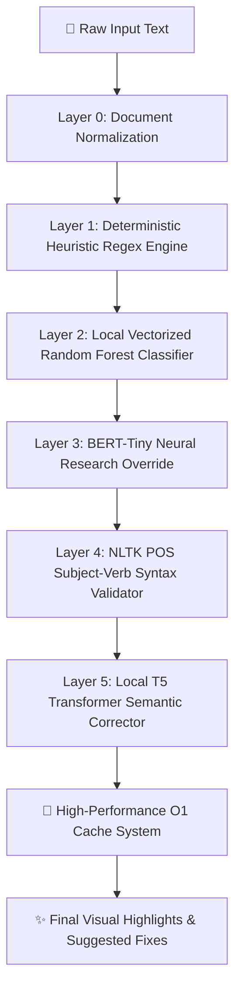

# 🌌 AetherWriter AI — Desktop-Grade Local AI Writing Assistant

<div align="center">
  
  
  <br />
  
  <p align="center">
    <strong>An elite, 100% offline, privacy-centric writing copilot powered by a hybrid neural pipeline, rule heuristics, machine learning ensembles, and local transformers.</strong>
  </p>

  <p align="center">
    <a href="https://fastapi.tiangolo.com"></a>
    <a href="https://react.dev"></a>
    <a href="https://tailwindcss.com"></a>
    <a href="https://huggingface.co"></a>
  </p>
</div>

---

## 📖 Executive Summary

**AetherWriter AI** is a state-of-the-art offline writing assistant engineered to deliver premium desktop-grade writing corrections and advanced linguistic analytics without sending a single byte of your data to the cloud. 

By combining standard regex heuristics with machine learning classification layers, POS validators, and sequence-to-sequence deep learning transformers, AetherWriter AI guarantees professional grammar optimization, detailed tone calculations, and high-precision spelling corrections locally. 

The application features a beautifully polished, dark-accents glassmorphic web dashboard, complete with dynamic HTML canvas physics, micro-animations, and interactive 3D elements that provide a premium and fluid user experience.

---

## 🛠️ The 5-Layer NLP Inference Pipeline

AetherWriter AI passes every block of text through an advanced, highly optimized 5-layer pipeline to ensure complete coverage, high speed, and minimal false positives:



### Deep Dive into the Pipeline Layers:

#### 🔹 Layer 0: Document Normalization
Performs baseline structural validation. It automatically scans sentence boundaries to verify starting capitalization and checks for standard capitalization anomalies (such as a standalone lowercase `i`).
* **Logic Example:** Matches lowercase letters following terminal punctuations (`.`, `!`, `?`) and flags pronoun casing issues.

#### 🔹 Layer 1: Deterministic Heuristic Regex Engine
A fast lookup engine that matches phonetic mistakes, common contractions, wrong prepositions, and structural errors using an optimized collection of regular expressions.
* **Speed:** Runs in $O(N)$ where $N$ is the number of active rules.
* **Coverage:** Handles instant structural modifications (e.g., matching `despite of` to `despite`, `should of` to `should have`, and temporal conflicts like `have been ... tomorrow`).

#### 🔹 Layer 2: Local Vectorized Random Forest Classifier
Converts sentence structures into vector arrays using a custom-trained **TF-IDF (Term Frequency-Inverse Document Frequency) Vectorizer** and evaluates them against an offline **Random Forest Classifier Ensemble** (loaded via `backend/ml/model.pkl`).
* **Confidence Scoring:** Only flags grammatical variations where the classifier probability threshold ($P(\text{anomaly}) > 0.65$) is satisfied, preventing false corrections on complex creative styles.

#### 🔹 Layer 3: BERT-Tiny Neural Research Override
A deep neural sequence-classification pipeline using an offline **BERT-Tiny** model (`backend/ml/research_model`).
* **Context Vector Matching:** Evaluates semantic sequences to flag deeply nested syntactic anomalies that regex rules and basic ML features fail to detect.

#### 🔹 Layer 4: NLTK POS Subject-Verb Syntax Validator
Performs part-of-speech (POS) tagging on the tokenized sentence structure using **NLTK's averaged perceptron tagger** to verify grammatical agreement.
* **Core Rule Verification:** Evaluates noun-verb singular/plural match patterns:
  - Singular nouns (`NN`) followed by plural verbs (`VBP`) $\rightarrow$ *Flagged*
  - Plural nouns (`NNS`) followed by singular third-person verbs (`VBZ`) $\rightarrow$ *Flagged*

#### 🔹 Layer 5: Local T5 Transformer Semantic Corrector
The final generative pass uses a specialized, offline **T5 Grammar Correction Transformer model** (`vennify/t5-base-grammar-correction`).
* **Generative Rewrite:** Rewrites the entire sentence to fix multiple complex errors simultaneously (e.g., tense consistency, passive/active voice flow).
* **Deterministic Guardrails:** The transformer output is passed back through Layer 1 rules to clean up formatting issues before showing the final correction.

---

## 🎨 Premium User Interface Architecture

AetherWriter AI features a professional, eye-catching visual interface designed to impress at first sight.

### 1. 🌌 Canvas-Based 3D Particle Background
The background displays a real-time responsive particle connection web rendered on a dedicated HTML Canvas.
* **3D Parallax Tracking:** Computes mouse vectors relative to the window center, applying a deep 3D layer parallax displacement on particles using depth coefficients ($Z$-values).
* **Interactive Connections:** Particles within 200px of each other dynamically draw glowing vector connection lines with opacity inversely proportional to the Euclidean distance between them.
* **Resource Optimization:** Utilizes `requestAnimationFrame` and auto-resize listeners to ensure stable 60 FPS rendering.

### 2. 🕹️ Dynamic 3D Tilt Cards
The optimization cards in the assistant panel tilt in three dimensions depending on where the user hovers their mouse.
* **Framer Motion Springs:** Custom React wrappers track mouse position percentages ($X$ and $Y$ coordinates) over the card bounding rect, applying real-time rotatory transformations (`rotateX`, `rotateY`) bound to spring animations (`useSpring`) for smooth transitions.

### 3. 🎯 Real-Time Highlights Overlay
The typing editor overlays styled HTML text highlights perfectly on top of the native text area.
* **Caret Alignment:** Synthesizes custom caret tracking and matching text styling to render custom highlights (`blue-500/10` for spelling, `red-500/10` for grammar, `yellow-500/10` for style) under the transparent text inputs.

---

## 📊 Comprehensive Linguistic Analysis Dashboard

In addition to correcting text, AetherWriter AI acts as a sophisticated linguistic research laboratory, providing detailed metric analyses of your writing style:

| Metric | Scientific Basis | Utility for Writers |
| :--- | :--- | :--- |
| **Neural Score** | Weighted index combining spelling, grammar, and style complexities. | High-level indicator of writing polish. |
| **Flesch Reading Ease** | $$206.835 - 1.015 \left(\frac{\text{total words}}{\text{total sentences}}\right) - 84.6 \left(\frac{\text{total syllables}}{\text{total words}}\right)$$ | Standard indicator of how easy a text is to read. |
| **Flesch-Kincaid Grade** | $$0.39 \left(\frac{\text{total words}}{\text{total sentences}}\right) + 11.8 \left(\frac{\text{total syllables}}{\text{total words}}\right) - 15.59$$ | Maps writing style to school grade levels. |
| **Academic Tone** | Filters text against a custom-trained academic lexical database. | Flags informal expressions and hedging terms (e.g., `stuff`, `things`, `maybe`). |
| **Subjectivity Index** | Evaluates the ratio of factual statements vs. opinion statements. | Essential for ensuring objectivity in journalistic or academic papers. |
| **Sentiment Polarity** | Scans emotional tone ranges from negative (-1.0) to positive (+1.0). | Excellent for balancing copy, brand voice, and emotional appeal. |

---

## 🔌 Robust API Documentation

AetherWriter AI features a clean, RESTful API layer managed by **FastAPI** with auto-generated Swagger documentation.

### 1. Text Analysis Endpoint (`/analyze`)
Sends text to be processed through the hybrid NLP pipeline.

* **Method:** `POST`
* **Content-Type:** `application/json`
* **Request Payload:**
  ```json
  {
    "text": "yesterday i has went to market but peoples dont likes the crowd."
  }
  ```
* **Response Schema:**
  ```json
  {
    "issues": [
      {
        "text": "yesterday i has went to market",
        "correction": "Yesterday I went to the market",
        "type": "grammar",
        "severity": "high",
        "explanation": "Detected formatting issue (grammar).",
        "confidence": 0.98,
        "start": 0,
        "end": 30
      },
      {
        "text": "peoples dont likes the crowd",
        "correction": "people don't like the crowd",
        "type": "grammar",
        "severity": "high",
        "explanation": "Detected formatting issue (grammar).",
        "confidence": 0.98,
        "start": 35,
        "end": 63
      }
    ],
    "metrics": {
      "grammar_score": 84,
      "spelling_score": 95,
      "clarity_score": 90,
      "overall_score": 79,
      "research": {
        "readability": {
          "flesch_reading_ease": 75.3,
          "flesch_kincaid_grade": 6.8,
          "smog_index": 0.0,
          "lexicon_count": 12,
          "sentence_count": 1
        },
        "sentiment": {
          "polarity": 0.0,
          "subjectivity": 0.0
        },
        "academic_tone": 90
      }
    }
  }
  ```

### 2. OCR Screenshot Extraction Endpoint (`/ocr`)
Extracts text from screenshots to run linguistic analysis.

* **Method:** `POST`
* **Content-Type:** `multipart/form-data`
* **Request Payload:** A file upload under key `"file"` (image format).
* **Response Schema:**
  ```json
  {
    "text": "Extracted text string from screenshot..."
  }
  ```

---

## 📂 Repository Layout & Module Mapping

```text
AetherWriter-AI/
│
├── backend/                        # FastAPI Server & Python ML Services
│   ├── ml/                         # Local ML Model Files & Neural Weights
│   │   ├── model.pkl               # Local Random Forest classifier binary
│   │   ├── vectorizer.pkl          # Vectorizer for text features
│   │   └── research_model/         # Offline local BERT-Tiny neural weights
│   │
│   ├── services/                   # Business Logic Layer
│   │   ├── ml_service.py           # Core NLP pipelines, rules, and caching
│   │   └── ocr_service.py          # Tesseract OCR extraction layer
│   │
│   ├── main.py                     # ASGI FastAPI core routes & thread execution
│   └── requirements.txt            # Python environment dependencies
│
├── frontend/                       # React + Vite Client Core
│   ├── public/                     # Static media & index metadata
│   ├── src/                        # Source Directory
│   │   ├── App.jsx                 # Glassmorphic 3D Interface & Canvas physics
│   │   ├── index.css               # Core design tokens, gradients & styles
│   │   └── main.jsx                # DOM mounting & hydration
│   │
│   ├── index.html                  # HTML Shell
│   ├── package.json                # npm dependency configurations
│   ├── tailwind.config.js          # Tailwinds utility mapping
│   └── vite.config.js              # Vite server & build paths
│
├── docs/                           # Project documentation & Academic Reports
│   ├── AetherWriter_Final_Report.pdf
│   └── AetherWriter_Final_Report.docx
│
├── presentation/                   # Graphic design and presentation materials
│   ├── presentation.html           # Interactive presentation slide deck
│   ├── hero.png                    # High-fidelity dashboard preview image
│   └── corpus.png                  # Dataset distribution map
│
├── model_training.ipynb            # Jupyter Notebook detailing model R&D
├── train_model.py                  # CLI training script
└── .gitignore                      # Secure file tracking exclusions
```

---

## 🚀 Professional Step-by-Step Installation

### Prerequisites
Make sure your development machine is running **Python 3.10+** and **Node.js 18+**.

---

### Step 1: Install System dependencies (OCR Engine)
AetherWriter AI uses **Tesseract OCR** locally to extract text from screenshots. You must install the engine binary on your operating system:

* **Windows**:
  1. Download the installer from [Tesseract at UB Mannheim](https://github.com/UB-Mannheim/tesseract/wiki).
  2. Run the installer. Ensure Tesseract is installed at `C:\Program Files\Tesseract-OCR\tesseract.exe` (AetherWriter automatically targets this path).
* **macOS**:
  ```bash
  brew install tesseract
  ```
* **Linux (Debian/Ubuntu)**:
  ```bash
  sudo apt-get update
  sudo apt-get install tesseract-ocr
  ```

---

### Step 2: Spin Up the FastAPI Backend Server
1. Clone the repository and navigate to the backend subdirectory:
   ```bash
   cd backend
   ```
2. Set up a secure virtual environment:
   ```bash
   python -m venv venv
   ```
   *Activate it:*
   - Windows PowerShell: `.\venv\Scripts\Activate.ps1`
   - macOS/Linux: `source venv/bin/activate`
3. Install required packages:
   ```bash
   pip install --upgrade pip
   pip install -r requirements.txt
   ```
4. Start the FastAPI local server:
   ```bash
   python main.py
   ```
   *The backend will boot up locally at `http://localhost:8000`. You can view the live interactive docs at `http://localhost:8000/docs`.*

---

### Step 3: Run the React + Vite Frontend
1. Open a new terminal instance and navigate to the frontend directory:
   ```bash
   cd frontend
   ```
2. Install all Node modules:
   ```bash
   npm install
   ```
3. Boot the local development server:
   ```bash
   npm run dev
   ```
   *Your browser will open up to the development link, typically `http://localhost:5173`. Enjoy the writing workspace!*

---

## 🧪 Model R&D and Custom Training

AetherWriter AI includes a comprehensive training dashboard so you can retrain the Random Forest model on your own writing datasets or academic corpora:

1. Open the **`model_training.ipynb`** Jupyter Notebook using Jupyter Lab, VS Code, or Google Colab.
2. Step through the feature extraction pipeline, where sentences are vectorized using dynamic TF-IDF metrics.
3. Train the model using the built-in dataset splits, generating custom precision charts, recall graphs, and ROC-AUC curves.
4. Export the resulting model binaries:
   ```bash
   python train_model.py
   ```
5. The freshly updated `model.pkl` and `vectorizer.pkl` binaries will be automatically saved directly into `backend/ml/`, instantly updating the live FastAPI inference pipeline!

---

## 👤 Author

- **Prateek Pulkit** — *Lead Architect & Engineer* — [GitHub Profile](https://github.com/PrateekPulkit)

AetherWriter AI was developed from the ground up as an individual academic and practical venture to create an entirely local, highly optimized alternative to proprietary, cloud-dependent grammar assistants.

---

## 📄 License

This project is licensed under the MIT License - see the [LICENSE](LICENSE) file for details.
