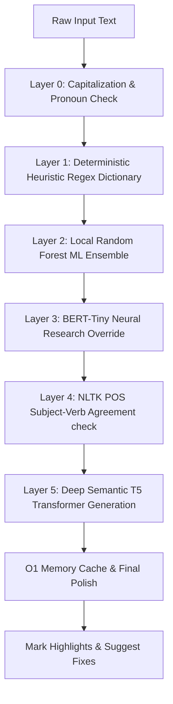

# 🌌 AetherWriter AI — Advanced Local AI Writing Assistant

[](LICENSE)
[](https://fastapi.tiangolo.com)
[](https://react.dev)
[](https://huggingface.co)

AetherWriter AI is a production-quality, **100% offline, locally-running AI writing assistant**. It features real-time grammar, spelling, and style optimization powered by a sophisticated multi-layered NLP pipeline—combining lightning-fast regex heuristics, a machine learning Random Forest classifier, an advanced BERT-Tiny research neural override, NLTK parts-of-speech (POS) validators, and a local deep semantic T5 transformer language model. 

The entire experience is wrapped in an elite, premium, glassmorphic 3D interface featuring a mouse-reactive neural connection background.

---

## 📸 Interface Preview

AetherWriter AI features a state-of-the-art user interface designed with modern aesthetics (glassmorphism, vibrant dark-accents, and fluid transitions):


---

## ✨ Features

- **🛡️ 100% Local & Privacy-First**: Zero cloud dependencies. Your texts, thoughts, and documents never leave your local machine.
- **⚡ Real-Time Hybrid NLP Pipeline**: Evaluates and flags grammar, spelling, and style issues on-the-fly as you type.
- **👁️ OCR Screenshot Scan**: Directly upload or scan screenshots of text using integrated Tesseract OCR to analyze writing samples instantly.
- **📊 Advanced Linguistic Research**:
  - **Readability Index**: Computes Flesch Reading Ease and Flesch-Kincaid Grade Level.
  - **Academic Tone Analysis**: Evaluates language for academic rigor, highlighting hedges and informal phrases.
  - **Subjectivity & Sentiment**: Measures emotional polarity (-1 to +1) and objective vs. subjective tone.
- **📝 Export Research Reports**: One-click export of complete, professional markdown linguistic analyses of your text.
- **🎨 Elite Interactive Frontend**:
  - Customized 3D Tilt Cards responding to mouse cursor coordinates.
  - Reactive character limit progress indicators.
  - Dynamic 3D HTML Canvas-based Particle Neural Connection Web that responds to hover and cursor movements.

---

## 🛠️ System Architecture & NLP Inference Pipeline

AetherWriter AI employs a high-concurrency, multi-layer asynchronous pipeline to guarantee zero-latency typing analysis while running deep machine learning inference.

### Asynchronous Concurrency Model
To prevent blocking the FastAPI ASGI event loop during intensive CPU/GPU nlp inference, heavy neural operations are offloaded to a dedicated high-concurrency **`ThreadPoolExecutor`**:

```python
# FastAPI Endpoint Offloading (main.py)
executor = ThreadPoolExecutor(max_workers=4)

@app.post("/analyze")
async def analyze(request: AnalysisRequest):
    loop = asyncio.get_event_loop()
    result = await loop.run_in_executor(executor, analyze_text, request.text)
    return result
```

### The 5-Layer Decision Pipeline

Every text string goes through a highly optimized sequence of checks to balance precision (low false positives) with coverage:



1. **Layer 0 (Context Check)**: Standard checks for sentence capitalization and pronoun 'I' casing.
2. **Layer 1 (Regex Heuristics)**: Deterministic dictionary mapping of common phonetic mistakes, contractions, and grammatical rule violations.
3. **Layer 2 (ML Random Forest)**: Standard vectorized TF-IDF pipeline classifying semantic structuring using a local Scikit-Learn Random Forest ensemble.
4. **Layer 3 (BERT-Tiny Neural Core)**: Deep transformer-based anomaly detector flagging structural inconsistencies.
5. **Layer 4 (NLTK POS Tagging)**: Automated part-of-speech analyzer verifying strict Subject-Verb agreement context.
6. **Layer 5 (Deep T5 Transformer)**: Generative grammar corrector suggesting sophisticated semantic changes, polished by our deterministic rules engine.

---

## 📂 Project Structure

```text
AetherWriter-AI/
├── backend/
│   ├── ml/
│   │   ├── model.pkl               # Trained Random Forest Model Binary
│   │   ├── vectorizer.pkl          # Vectorizer for text features
│   │   └── research_model/         # BERT-Tiny neural core weights
│   ├── services/
│   │   ├── ml_service.py           # Core NLP & ML pipeline service
│   │   └── ocr_service.py          # Tesseract OCR extraction layer
│   ├── main.py                     # FastAPI routes & thread-pool execution
│   └── requirements.txt            # Python dependencies
├── frontend/
│   ├── public/                     # Static assets
│   ├── src/
│   │   ├── App.jsx                 # Elite 3D Dashboard UI
│   │   ├── index.css               # Modern glassmorphic styles
│   │   └── main.jsx
│   ├── index.html                  # Core HTML5 shell
│   ├── package.json                # React dependencies
│   ├── tailwind.config.js          # Tailwind CSS layout configurations
│   └── vite.config.js              # Vite server build configuration
├── docs/                           # Academic Reports & System Manuals
│   └── AetherWriter_Final_Report.pdf
├── presentation/                   # Presentation files & visual assets
│   ├── presentation.html           # Interactive HTML Presentation Slides
│   └── hero.png                    # Dashboard preview screenshot
├── model_training.ipynb            # ML training pipeline notebook
├── train_model.py                  # CLI script for model training
└── .gitignore                      # Security-centric Git file exclusion rules
```

---

## 🚀 Installation & Local Setup

Ensure you have **Python 3.10+** and **Node.js 18+** installed on your machine.

### 1. OCR Pre-requisites (Optional)
To use the Screenshot OCR scanning feature, install Tesseract OCR on your system:
- **Windows**: Download and install the Tesseract installer from UB Mannheim. Ensure it is installed at `C:\Program Files\Tesseract-OCR\tesseract.exe`.
- **macOS**: Install via Homebrew: `brew install tesseract`
- **Linux**: Install via apt: `sudo apt install tesseract-ocr`

### 2. Backend Setup
1. Navigate to the backend directory:
   ```bash
   cd backend
   ```
2. Install all Python dependencies:
   ```bash
   pip install -r requirements.txt
   ```
3. Run the FastAPI development server:
   ```bash
   python main.py
   ```
   *The backend server will spin up on [http://localhost:8000](http://localhost:8000).*

### 3. Frontend Setup
1. Open a new terminal tab and navigate to the frontend directory:
   ```bash
   cd frontend
   ```
2. Install all node packages:
   ```bash
   npm install
   ```
3. Boot up the Vite dev server:
   ```bash
   npm run dev
   ```
   *Open the browser to the address shown in the terminal (usually [http://localhost:5173](http://localhost:5173)).*

---

## 📊 ML Model Training & R&D

If you wish to re-train the Random Forest machine learning classifier or explore the feature extraction process:
1. Ensure your backend virtual environment is active.
2. Run the training script:
   ```bash
   python train_model.py
   ```
   or step through the interactive **`model_training.ipynb`** notebook to visualize model performance metrics, confusion matrices, and ROC-AUC curves.
3. Newly trained model files (`model.pkl` and `vectorizer.pkl`) will be outputted directly to `backend/ml/`.

---

## 👤 Author

- **Prateek Pulkit** — *Sole Developer & Architect* — [GitHub Profile](https://github.com/PrateekPulkit)

This project was built from scratch as an individual academic and practical venture to create an entirely local, production-quality alternative to cloud-dependent writing assistants.

---

## 📄 License

This project is licensed under the MIT License - see the [LICENSE](LICENSE) file for details.
